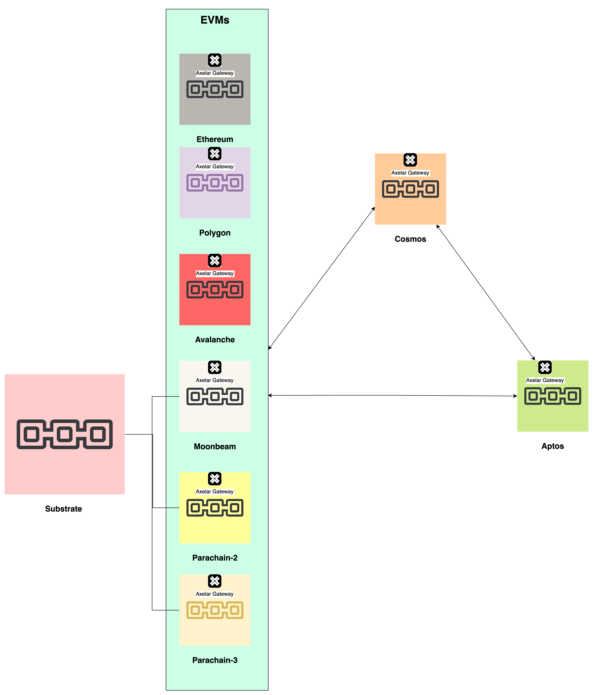

# Cross-chain

## Overview

Cross-chain is a term used to describe the ability to exchange assets between two different blockchains. It is a process that allows the transfer of value, data, or logic between different chains. Cross-chain is a term used to describe the ability to exchange assets between two different blockchains. It is a process that allows the transfer of value, data, or logic between different chains.

## Projects

- [Axelar GMP](https://docs.axelar.dev/dev/general-message-passing/overview)

  - Currently, it is supporting Cosmos & EVM chains.
  - Very soon they are going for Cosmos & Aptos.
  - _Message Execution engine_: **Axelar Gateway contract** is to be deployed on every chain that wants to be supported with Axelar incoming messaging processing. Moreover, corresponding library (solidity, move, etc.) should also be developed for the same chain, otherwise, the Gateway won't work for the message being passed from the source chain.

  So, any chain which supports these VMs - Cosmos, EVM, Aptos, can leverage the cross-chain messaging protocol of Axelar.

  - Axelar GMP (started from Cosmos) is analogous to XCMP of Substrate.
  - The destination chain receives signed message & then executes it. So, no need of ensuring the gas cost by the sender (on source chain).

- [Layerzero](./layerzero.md)
- Substrate XCM
- Cosmos IBC

---

A case study with my thoughts in order to build a project to be supported by Axelar GMP for cross-chain purposes like cross-chain token swap.

Here is the architecture diagram (HLD):

## Concepts

## Architecture

[diagram](./architecture.drawio)

### DeFi

From DeFi standpoint, cross-chain token transfer, trades, and lending are the most important use cases.

In general, these are the steps involved in a cross-chain swap:
If, as in the example in the introduction, Chain B is a new chain that **Alice** is trying to explore, the process can be frustratingly complex.

1. First, **Alice** has to find a DEX on Chain B that has liquidity for the pair she wants to swap. This will be a pair between the bridged version of the Chain A asset and the native version of the Chain B asset. (Axelar provides a list of pools for this.) If this doesn’t exist, **Alice** is out of luck – or, she has to do an additional swap, to get into an asset that has a liquid pair with the desired asset on Chain B.
2. Before **Alice** can get to the final step, she'll need to make sure she has two things: a Chain B wallet and enough of the Chain B gas token to pay the transaction fee for the swap.
3. Once **Alice** finds liquidity and has wallets and gas tokens set up on both chains, she heads to a bridge that links the two chains, connects her Chain A wallet, and initiates the bridge to Chain B.
4. **Alice** initiates the swap on the Chain B DEX and breathes a sigh of relief.

Now, this approach has a problem of cross-chain liquidity. If there is no liquidity on the target chain, then the swap will fail. This is where the cross-chain liquidity pools come into play. Hence, the term "Cross-chain Liquidity Router".

So, there are the solutions to this problem:

- **Cross-chain messaging protocols**: Make the logic work across chains irrespective of the protocols like EVM, EOSIO, Solana, etc. In this way, the DEXes of the destination chain can be leveraged.
  - GMP: General Message passing
  - XCMP: Substrate's cross-chain messaging protocol
    - XCM: Substrate's cross-consensus messaging format.
- **cross-chain liquidity router** via cross-chain liquidity pools (like Uniswap) but with a twist of cross-chains.
  - Type-1: Here, there can be liquidity pools sitting on top of centralized/traditional infrastructure.
  - Type-2: There can be liquidity pools sitting on top of decentralized infrastructure like L0 solutions - Cosmos, Substrate. For instance, if we build a DEX on top of global storage of substrate global state, then all the parachains can leverage the available liquidity pools of the DEX.
    - Support other blockchain protocols: EVM, EOSIO, Solana, etc. via GMP or XCMP.
- **liquidity leveraging stablecoin for handling cross-chain liquidity & swaps**. [Squid](https://www.squidrouter.com/) project. It's a natural choice given that the stablecoin has a presence on every blockchain network.
  - Every swap using Squid is a combination of the below:
    1. Swap ERC20 --> native USDC (Uniswap or equiv)
    1. Swap native USDC --> axlUSDC (Curve or equiv)
    1. Bridge axlUSDC --> axlUSDC
    1. Swap axlUSDC --> native USDC (Curve or equiv)
    1. Swap native USDC --> ERC20 (Uniswap or equiv)

## References

- [What Is a Cross-Chain Swap?](https://axelar.network/blog/what-is-a-cross-chain-swap)
- [Benefits and Risks: Are Cross-Chain Bridges Worth It?](https://axelar.network/blog/cross-chain-bridges-benefits-limitations-risks)
- [LayerZero: The Language of the Omnichain](https://www.notboring.co/p/layerzero-the-language-of-the-omnnichain)
