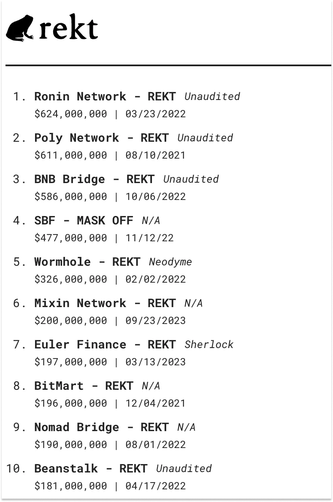

# LayerZero

## Overview

- **Founders**: Bryan, Ryan, and Caleb
- It's considered as "**the language of blockchains**".
- It's often compared to **TCP/IP of internet**.
- It is a protocol that allows blockchains to communicate with each other.
- Since launch day, LayerZero has delivered over 87 million messages, with over 31,000 smart contracts live on Mainnet, and Bryan tells me that over $40 billion has moved through its pipes… all without a hack.

## Notes

- v1 vs v2:
  - In v1, verification and execution were provided by Oracles and Relayers. In v2, they’re provided by **Decentralized Verifier Networks (DVNs)** and **Executors**.
  - What hasn’t changed between v1 and v2 is that endpoints are immutable and validation libraries are append-only.
  - Importantly, in v2, LayerZero Labs has totally decoupled security from execution in order to guarantee censorship-resistance without impacting liveness, or the ability of the protocol to continue functioning and processing transactions without interruption.
- Verification and execution of messages are up to the application to decide; they can hook any set of verifiers and any executor they choose into the protocol.
- Traditional way of **bridging chains**:
  
  So if you wanted to send your tokens from say, Ethereum to Polygon, in order to use an app on Polygon, you’d go to a bridge and the bridge would do a few things:

  - **Lock the Original Asset**. Essentially, the bridge sends your ETH to a smart contract that holds it “securely.”

  - **Create a Wrapped Version**. The bridge issues a “wrapped” version of your ETH, WETH, that represents your original ETH but works with Polygon’s rules.

  - **Give You the Wrapped Version**. The bridge puts the WETH in your wallet on Polygon, which you can use to do things on Polygon.

  - **Redeem the Original Asset**. To redeem your original ETH on Ethereum, you send your WETH back to the bridge, the bridge burns it, unlocks your original ETH, and puts it in your Ethereum wallet, where you can use it to do things on Ethereum.

- Bridges hacks: All of that locked ETH (or whatever locked token) is a gigantic flashing sign that there’s a pot of money hackers can try to break into
  - [Wormhole Bridge between Solana and Ethereum for $326 million](https://cointelegraph.com/news/wormhole-token-bridge-loses-321m-in-largest-hack-so-far-in-2022) on Feb 22.
  - [Ronin Bridge between Ronin and Ethereum for $624 million](https://www.coindesk.com/tech/2022/03/29/axie-infinitys-ronin-network-suffers-625m-exploit/) on Mar 22.
  
  There was another problem that is lack of nodes that guarantee the security of money pots (locked tokens). Ronin was attacked that way. It was way too centralized with few nodes getting compromised via sending phishing clicks by one of the nodes & then 2/3 of the nodes were compromised.

  <details><summary>More hacks:</summary>

  

  </details>

  Second, **they’re slow, painful, and a little bit scary**. Bridging tokens means figuring out how to get the native token of the chain you’re bridging to in order to pay gas fees for that end of the transaction, putting your valuable tokens into a website, signing them away, and then waiting for a painfully long time. More than once, I’ve worried if my tokens were lost forever while I waited.
- By building a messaging protocol instead of a bridge, LayerZero Labs eliminated the idea of locking and wrapping tokens, got rid of the honeypot, bundled a bunch of steps into one message, and removed the need to worry about gas.
- Chain A sends a message containing bytes to Chain B, and Chain B executes whatever instructions are contained in the bytes.
- Standards:
  - **Omnichain Fungible Token (OFT)**: “This standard works by burning tokens on the source chain whenever an omnichain transfer is initiated, sending a message via the protocol and delivering a function call to the destination contract to mint the same number of tokens burned, creating a unified supply across both networks.”
- Usages:
  - Transfer, Swap, Purchase: a user could move OFT X from Chain A, swap it on chain B for OFT Y, and then use OFT Y to purchase an NFT on chain B.
- **Oracle's job**: fetch block headers – like a summary of each block on the blockchain – from Chain A and send it to Chain B so that each chain can verify the other’s current state and integrity. At launch, Chainlink, a leading oracle, was the most popular option, and in September, LayerZero Labs announced that Google Cloud would become the default Oracle. The lab assumed that there would be initiative to create a meta-oracle which would consist of many oracles, but didn't happen.
- **Relayer's job**: is to provide the necessary proof that a particular event or transaction happened on Chain A, which Chain B could then act upon. For example, it could say, “Yes, the user approved sending 10 ETH from Ethereum to Polygon, and we, Chain A, have burnt the 10 ETH. Your turn.”  Crucially, the Relayer was responsible for both security and execution. It handled things like quoting pricing pairs across 40+ different chains in real-time, sending 50-80 billion RPC calls per month to get information, writing millions of messages to chain, and abstracting gas payments away from the user.
- To get widespread adoption and become the TCP/IP for blockchains, LayerZero has to do two things, each of which reinforces the other:
  - **Hook into More Chains**. Deploy endpoints on more chains so that the protocol can serve developers and users wherever they want to operate.
  - **Integrate with More Apps and Protocols**. Convince more applications and protocols to build on LayerZero to build omnichain apps or bridge their tokens by adopting the OFT Standard.

  The more chains LayerZero is on, the more compelling the value prop for more apps and protocols.
- LayerZero vs Wormhole voting for Uniswap v3's decision to use as cross-chain protocol. [Entire thread](https://www.notboring.co/i/139780381/how-interoperability-protocols-compete), if interested.
  - Reasoning given by Uniswap v3 Governance to choose Wormhole over LayerZero via voting (although a16z couldn't vote due to infrastructure unavailability, supported LZ via tweet):
  > After assessing the current version of the LayerZero protocol, the Committee has concluded that it does not currently satisfy the full breadth of the requirements of the Uniswap DAO's cross-chain governance use case as outlined in the assessment framework, but is on a path to do so. LayerZero employs a combination of two types of validators to secure the protocol: Oracles and Relayers. **However, currently, the available options for Oracles and Relayers do not offer the level of decentralization and security required for Uniswap's use case. LayerZero has a planned upgrade to its oracle and relayer set that would likely address these concerns.**
  - Conclusion: The immutability of the LayerZero protocol and the potential for applications to choose their own Oracles are both advantages over Wormhole in theory, but in practice, its security model looked too much like a 2-of-2 multisig with Chainlink and LayerZero Labs as the signers. While Wormhole contracts are upgradeable, which introduces risk, and while Wormhole doesn’t allow applications to configure their own validator sets, a 13-of-19 Guardians model appeared to be more decentralized.
- The thing is… Bryan agrees. LayerZero v1 has been safe and has successfully handled a ton of messages and assets, but in practice, the messaging around Oracles was too confusing, and building a Relayer was too hard, for most projects to move beyond the defaults.

  So for the past 18 months, the team has been cooking up something new and improved.

  And there comes the birth of LZ v2.
- Why it's hard to implement own relayer of LZ?
  - In theory, anyone could build and deploy their own Relayer. In practice, Bryan told me, “A Relayer is impossibly hard to run. We had to build an internal custodian, real-time n^2 pricing, write more messages to chain than anyone in the world, and essentially run Alchemy internally.” So no one built Relayers.

  And because no one built Relayers, LayerZero Labs was a potential chokepoint. If LayerZero Labs’ Relayer went down, the whole network would have a liveness issue – transactions wouldn’t go through – until someone, likely the App itself, came in and picked up transactions. [Source](<https://www.notboring.co/p/layerzero-the-language-of-the-omnnichain>)
- Applications are responsible for their own extrinsic security, and for selecting an Executor.
- Instead of Relayers, applications choose their own Executors, which live outside of the security of the protocol. These Executors are mainly responsible for quoting prices and gas and handling all of the complexities of transactions for applications and their users. In exchange, they’ll charge a small fee on top of the cost of gas.
- **DVN**:
- **Executors**: These are mainly **responsible for quoting prices and gas and handling all of the complexities of transactions** for applications and their users. In exchange, they’ll charge a small fee on top of the cost of gas.
  
  LayerZero Labs will run an optional Executor that applications can choose to run, and that will be the default out of the box, but it encourages applications to set up their own configurations. LayerZero Labs will have to compete on price and service. Importantly, Executors are much simpler to run than Relayers, because v2 decouples security and execution, so LayerZero Labs expects there to be strong competition. If needed, applications can even execute easily onchain or users can self-execute.
- **Fees**: As per v1, they had 3 fees: Relayer, Oracle, LZ (protocol). In v2, this will be replaced by, Verifier Fees (to DVN), Executor Fees (to executors), and LayerZero Fees in v2.

> **From a product perspective, LayerZero is like TCP/IP. From a business perspective, it’s like VISA.** Although Bryan disagrees.
>
> If Stripe’s mission is to increase the GDP of the internet, LayerZero’s might be to increase the GDP of the Omnichain

- As new **Verifiers** come into the network and compete for business, the Security-Cost Pareto Frontier shifts. As new **Executors** come into the network and compete for business, execution gets tighter. As new chains come online, each with improvements to previous models, the **Omnichain** gets stronger.

### Development

- Make sure LZ endpoint is deployed on the new chain before going ahead. [Source](https://docs.layerzero.network/contracts/project-setup#adding-external-networks).
- [Set LZ config](https://docs.layerzero.network/contracts/project-config#modifying-layerzero-config):
  - The npx package uses `@layerzerolabs/lz-definitions` to enable you to reference both V1 and V2 Endpoints. Make sure if your project uses LayerZero V2 to select the V2 Endpoint (i.e., `eid: EXAMPLE_V2_MAINNET`).
  - Deployed address can be used in defining the contract in `layerzero.config.ts`:

  ```ts
  // Define the Mumbai (Polygon) contract

  // address can also be specified for deployed contracts.
  const mumbaiContract = {
    eid: EndpointId.POLYGON_V2_TESTNET,
    address: '0x123',
  };
  ```

  - After defining what contracts to use on each network, you can specify which contracts should be connected on a per pathway basis.
  - [Config DVNs](https://docs.layerzero.network/contracts/configure-dvns) in LZ OApp. By default it is not required.
- **quote before send tx**: Because cross-chain gas fees are dynamic, this quote should be generated right before calling _lzSend to ensure accurate pricing.

> INFO:
>
> Remember that when sending a message through LayerZero, the msg.sender will be paying for gas on the source chain, fees to the selected DVNs to validate the message, and for gas on the destination chain to execute the transaction. This results in a single bundled fee on the source chain, abstracting gas away on every other chain, leading to better composability.

- [Message Patterns](https://docs.layerzero.network/contracts/message-design-patterns) can be used for different use case especially in DeFi utilities where the good liquidity pools are scattered across multiple networks.
- **Delegate in OApp**: In a given OApp, a delegate is able to apply configurations on behalf of the OApp. This delegate gains the ability to handle various critical tasks such as setting **configurations** and **MessageLibs**, and skipping or clearing **payloads**.

  By default, the contract owner is set as the delegate using `setDelegate()` function. [More on setting custom config](https://docs.layerzero.network/contracts/oapp-configuration).
- Make your blockchain/contract(s) compatible with LayerZero:
  - [Option-1](https://docs.layerzero.network/contracts/sending-tokens#option-1-protocols-or-dexs-built-on-layerzero) has a dependency on Stargate bridge to support your chain.
  - [Option-2](https://docs.layerzero.network/contracts/sending-tokens#option-2-wrapped-asset-bridges) requires to contact LZ or deploy [LZ endpoint](https://docs.layerzero.network/explore/layerzero-endpoint) on your chain. This setup required on [source](https://docs.layerzero.network/explore/layerzero-endpoint#sending-endpoint) chain & [destination chain](https://docs.layerzero.network/explore/layerzero-endpoint#receiving-endpoint)
- More on [DVNs](https://docs.layerzero.network/explore/decentralized-verifier-networks) who are responsible for verifying the messages sent to destination chain.
- More on [Executors](https://docs.layerzero.network/explore/executors) and their roles details. They mainly take charge after it is verified by DVNs.
  
## Tools

- [LZ block explorer](https://layerzeroscan.com/)
  - `In flight` status: Message has not been delivered yet.
  - `Delivered` status: Message has been delivered.

## Community

- [Discord](https://discord-layerzero.netlify.app/discord)

## References

- [LayerZero: The Language of the Omnichain](https://www.notboring.co/p/layerzero-the-language-of-the-omnnichain) ✅
- [LayerZero V2 Deep Dive](https://medium.com/layerzero-official/layerzero-v2-deep-dive-869f93e09850)
