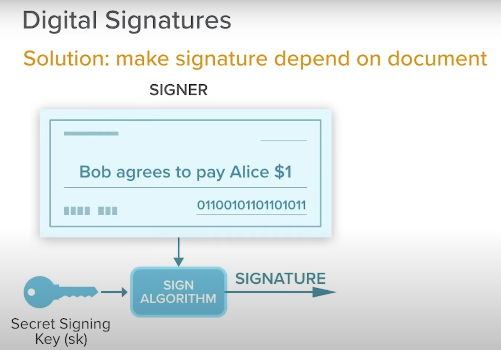

# My_Learning-Blockchain

This is based on my learning about blockchain protocol as a whole.

Learn about all types of blockchains including payment-only networks like Bitcoin, smart contract platforms like Ethereum, and even decentralized storage networks like IPFS and Storj.

## Overview

The architecture diagrams required for a smart contracts:

1. Cross-chain diagram
2. Data model diagram
3. Sequence diagram
   - consists of functions call mostly

## Concepts

These concepts are common for all the blockchains when they are built.

51% attack:

- In 1st generation blockchains (Bitcoin), when a group of miners control more than 50% of the network's mining hashrate.

---

<u>Authoring node</u>: In a blockchain network, the node that creates a block. This node is selected via a consensus mechanism. The verifier node is the one that validates the block after getting added by the Authoring node. If it doesn't validate, the block is rejected. Hence, doesn't get added to the blockchain. Hence, the authoring node doesn't get the reward. The time taken to make a block immutable is called "Finality time".

---

<u>Sybil attack</u>:

- Problem: Each node is actually a part of 1 big entity. So, it can be controlled by 1 person.
- Solution: As per Nakamoto, Nodes committing to resources (e.g. Proof of Work, Proof of Stake, etc.) can be considered as Sybil attack resistant because they would have to commit to resources for each identity they want to create. This is expensive and not feasible.

  > In web2 world, sybil attack is controlled by KYC or phone number verification.

---

Digital signatures:

## Repositories

### AntelopeIO

- My repo: https://github.com/abhi3700/My_Learning_EOS

### Bitcoin

- My repo: https://github.com/abhi3700/My_Learning-Bitcoin

### Ethereum

- My repo: https://github.com/abhi3700/My_Learning-Ethereum

### Waves

- Python: https://github.com/PyWaves/PyWaves

### Steem

- My repo: https://github.com/abhi3700/My_Learning-Steem

## [GLossary](https://www.gemini.com/cryptopedia/glossary)

## Resources

- Blockchain 101 - http://www.blockchain-utopia.com/
- cryptocurrencies' block time, hashrate, etc. - https://bitinfocharts.com/ , https://coinmarketcap.com/
- Blockchain, Bitcoin, Ethereum tutorials YouTube playlist - https://www.youtube.com/watch?v=xwA2TkcAQgQ&list=PL6TbWIxWsLY0VPlese2_z5xDZZ33ZuvV6
- Awesome decentralised paper - https://github.com/xasos/awesome-decentralized-papers
- [Programming Cryptocurrencies and Blockchains](https://github.com/yukimotopress/blockchains)
